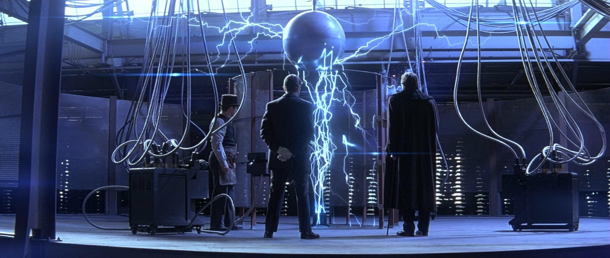

<h1 align="center"> Hi, I'm Tejas Nasa! </h1>

<em>
  
  - 👨‍💻 I’m a MERN Stack Web Developer
  
  - 💻 Check out my portfolio <a href="https://tejasnasa.vercel.app/">here</a>.
  
  - 📚 I’m currently learning everything about Backend Development

  - 💪🏼 Future Goals: Turn more ideas into reality
    
  - 📫 Reach me at <a href="mailto:tejasnasa2005@gmail.com">tejasnasa2005@gmail.com</a>
  
</em>

<h3 align="center">Languages and Tools:</h3>

  

<h3 align="center">Connect with me:</h3>

 

  

<!-- 

  

-->

<!--

## My Repos

 
 

## 
-->

<!--
**tejasnasa/tejasnasa** is a ✨ _special_ ✨ repository because its `README.md` (this file) appears on your GitHub profile.

Here are some ideas to get you started:

- 🔭 I’m currently working on ...
- 🌱 I’m currently learning ...
- 👯 I’m looking to collaborate on ...
- 🤔 I’m looking for help with ...
- 💬 Ask me about ...
- 📫 How to reach me: ...
- 😄 Pronouns: ...
- ⚡ Fun fact: ...
-->
